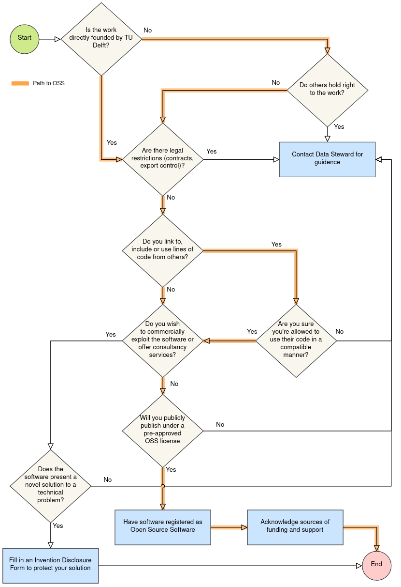

# [Repository Title]

*Delete the text in this section after reding it when using this template. Text between `[]` provides short descriptions of what is expected in each section, and should be deleted after after you write your own.*

**Purpose**

This repository provides a template to make your software project more compliant with the [FAIR principles.](https://fair-software.nl/) It adopts the recommendations made by the [TU Delft Guidelines on Research Software](https://d2k0ddhflgrk1i.cloudfront.net/TUDelft/Over_TU_Delft/Strategie/TU%20Delft%20Research%20Software%20Guidelines.pdf).

**How to use this template**

1. Create a new repository using this template.
2. Clone your repository.
3. Edit the text between [ ] in the README and CONTRIBUTING file. Explanations of the expected content for each section appear between [ ], and they should be removed. Leave text outside [ ] unchanged.
4. Start coding

**How to organize source code**

[The organization of your source code depends on the progamming language and the purpose of the code. However, here are some general recommendations:

1. Organize your source code in directories. Create a root-directory for the coder with the same name as repository. 
2. In the root directory include a tests directory for writing test for the source code. For example, in this template, source code should go in the `repo-template` directory.
3. As the source code grows, keep scripts organized in sub-directories, the rule of thrumb here is to keep related scripts together.
4. Use meaningful names for directories and scripts, and choose file names carefully.
5. Separate data from source code.]

> Important: when using this template, keep the stucture suggested in `repo-template`, but change the name to match you repository's name. 

*Delete this text above when using this template in your repository*

[Repository Description: In two or three sentences, describe the purpose of the repository: **what is this repository for?**]

## Installation

[Describe the steps  that users (not developers) should follow to install the code in each of the intended platforms (e.g. Window 10, MacOS, etc.).]

**Requirements** 
- [List the software, OS, and/or technologies on which the code depends, and add hyperlinks to the sources whenever possible.]
- [State any relevant hardware requirements.]

### [For Patform A]

[List and describe each step required to install the software. Use a description/example format. For example:]

[1. Install dependencies ]

```bash
[$ pip install -r requirements.txt]
```

### [Contributing Guidelines]

Read the [contributing guidelines](CONTRIBUTING.md) to know how can you take part in this project. 

[ Include a `CONTRIBUTING.md` files ]

## License

1. [Always decide on a license for your code. If no licensing is stated, the default of "no license" is "no one can make copies or derivative works of your code".]

[Under the current [guidelines on research software](https://d2k0ddhflgrk1i.cloudfront.net/TUDelft/Over_TU_Delft/Strategie/TU%20Delft%20Research%20Software%20Guidelines.pdf), TU Delft encourages the use of open source licenses for research software. Use the decision three below to determine if the software you intend to develop can be published as Open Source Software (OSS). You can also ask for help to the [Data Steward in your Faculty](https://www.tudelft.nl/library/research-data-management/r/support/data-stewardship/contact)]



[If using an open source license, select one of the followings **pre-approved** licences:]

[](http://creativecommons.org/publicdomain/zero/1.0/)

[](https://opensource.org/licenses/MIT)

[](https://opensource.org/licenses/BSD-3-Clause)

[](https://opensource.org/licenses/Apache-2.0)

[EUPL-1.2](https://opensource.org/licenses/EUPL-1.2)

[](https://www.gnu.org/licenses/old-licenses/gpl-2.0.en.html)

[](https://www.gnu.org/licenses/gpl-3.0)

[](https://www.gnu.org/licenses/lgpl-3.0)

2. [If an OSS license will be used. Edit the LICENSE file to match your case. It is a good practice to include  a copy of the license text in the LICENSE file.]

## Copyright

[TU Delft owns the copyrights of any software developed by TU Delft researchers. However, if the software is published as OSS, TU Delft agrees to transfer such rights to the Author(s) of the software. If using an OSS license, you can claim the copyright by using the following text:]

&copy; (YEAR) [Author(s)], Delft, The Netherlands. 

## Citation

[Include a [CCF file (Citation File Format)](https://citation-file-format.github.io/). See example in this repo: `CITATION.cff`. You can easily create the content of a CCF using [this tool](https://citation-file-format.github.io/cff-initializer-javascript/). ]

[CCF files can be converted to a multitude of formats, including BibTex,  EndNote, codemeta, plain JSON, schema.org, RIS, and Zenodo JSON ]

## Acknowlegdements

[Name anyone who deserves it.]
